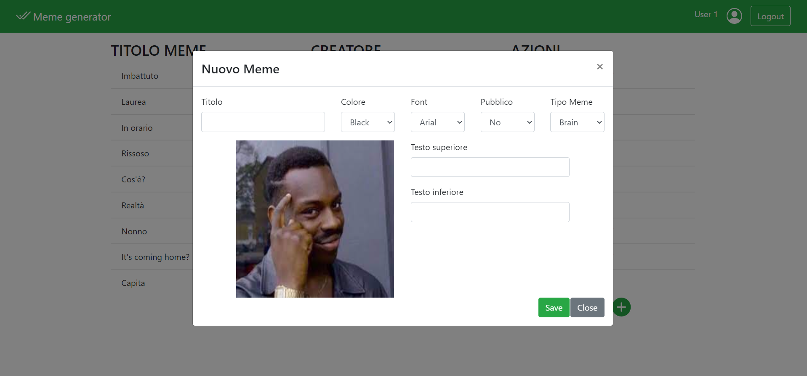

# Exam #2: "Generatore di meme"
## Student: s278073 BRAIA GERARDO 

## React Client Application Routes

- Route `/`: Pagina principale, permette di visualizzare l' elenco dei meme e di effettuare operazioni su di essi(visualizza, copia, elimina).
- Route `/login`: Permette di effettuare il login

## API Server

- GET `/api/AllMemes`
  - Restituisce la lista di tutti i meme
  - Response body content:
  ```
  [
    {
        "id_meme": 1,
        "id_tipo_meme": 1,
        "id_utente_creatore": 1,
        "titolo": "Imbattuto",
        "text_top": "Non puoi essere bocciato in WebApp",
        "text_mid": "",
        "text_bottom": "se non consegni il progetto",
        "pubblico": 1,
        "colore": "yellow",
        "font": "georgia",
        "flag_top": 1,
        "flag_mid": 0,
        "flag_bottom": 1,
        "path": "./img/Brain.jpg",
        "nome": "User 1"
    },
    {
        "id_meme": 4,
        "id_tipo_meme": 3,
        "id_utente_creatore": 2,
        "titolo": "Laurea",
        "text_top": "",
        "text_mid": "Quando ti laurei? Io:",
        "text_bottom": "",
        "pubblico": 0,
        "colore": "black",
        "font": "georgia",
        "flag_top": 0,
        "flag_mid": 1,
        "flag_bottom": 0,
        "path": "./img/Homer.png",
        "nome": "User 2"
    },
	...
  ]
  ```
- Error:

```
{
    "errors": "Database error getting memes."
}
```
  
- GET `/api/PublicMemes`
  - Restituisce la lista dei meme pubblici
  - Response body content:
  ```
  [
    {
        "id_meme": 1,
        "id_tipo_meme": 1,
        "id_utente_creatore": 1,
        "titolo": "Imbattuto",
        "text_top": "Non puoi essere bocciato in WebApp",
        "text_mid": "",
        "text_bottom": "se non consegni il progetto",
        "pubblico": 1,
        "colore": "yellow",
        "font": "georgia",
        "flag_top": 1,
        "flag_mid": 0,
        "flag_bottom": 1,
        "path": "./img/Brain.jpg",
        "nome": "User 1"
    },
    {
        "id_meme": 34,
        "id_tipo_meme": 2,
        "id_utente_creatore": 3,
        "titolo": "Rissoso",
        "text_top": "Quando ti accorgi che qualcuno ti fissa:",
        "text_mid": "",
        "text_bottom": "",
        "pubblico": 1,
        "colore": "white",
        "font": "arial",
        "flag_top": 1,
        "flag_mid": 1,
        "flag_bottom": 1,
        "path": "./img/Fry.jpg",
        "nome": "User 3"
    },
	...
  ]
  ```
- Error:

```
{
    "errors": "Database error getting memes."
}
```

- GET `/api/getTipiMeme`
  - Restituisce la lista di tutti i tipi-meme
  - Response body content:
  ```
  [
    {
        "id_tipo_meme": 1,
        "nome": "Brain",
        "path": "./img/Brain.jpg",
        "flag_top": 1,
        "flag_mid": 0,
        "flag_bottom": 1
    },
    {
        "id_tipo_meme": 2,
        "nome": "Fry",
        "path": "./img/Fry.jpg",
        "flag_top": 1,
        "flag_mid": 1,
        "flag_bottom": 1
    },
  ]
  ```
  - Error:

```
{
    "errors": "Database error getting type-memes."
}
```
  

- DELETE `/api/meme/:id`
  - Cancella il meme corrispondente all'id specificato
  - Error:

```
{
    "errors": "Database error during the deletion of the meme."
}
  
```
  
  
- POST `/api/creaMeme`
  - Crea un nuovo meme
  - Request parameters:
  ```
  {"idTipoMeme":3,
  "titolo":"Laurea", 
  "textTop":"", 
  "textMid":"Quando ti laurei? Io:", 
  "textBottom":"", 
  "pubblico":1, 
  "colore":"red", 
  "font":"arial"}
  ```
   - Error:

```
{
    "errors": "Database error during the creation of meme 'Laurea'."
}
```


- POST `/api/sessions`
  - Crea una nuova sessione
  - Request parameters:
  ```
  {"username":"user1@gmail.com",
  "password":"password"}
  ```
  - Response body:
  ```
  {"id"=1,
  "username":"user1@gmail.com",
  "nome":"User 1"}
  ```

- DELETE `/api/sessions/current`
  - Elimina la sessione corrente
  - Request parameters: Nessuno
  - Response body: Nessuno


- GET `/api/sessions/current`
  - Fa la get della sessione corrente
  - Request parameters: Nessuno
  - Response body: Nessuno
  - Error:

```
{
    "errors": "Unauthenticated user!."
}
```


## Database Tables

- Table `utenti` - contiene l'elenco degli utenti registrati.
   - Attributi: id_utente, email, password, nome.
- Table `tipo_meme` - contiene l'elenco dei diversi tipi di meme che è possibile creare.
   - Attributi: id_tipo_meme, nome, path, flag_Top, flag_mid, flag_bottom.
- Table `meme` - contiene la lista di tutti i meme creati, con i relativi attributi.
   - Attributi: id_meme, id_tipo_meme, id_utente_creatore, titolo, text_top, text_mid, text_top, pubblico, colore, font.

## Main React Components
 
- `LoginForm` (in `Login.js`): componente che gestisce il login degli utenti.  
- `ModaleNuovo` (in `ModaleMeme.js`): ccomponente che permette la creazione e la copia di un meme.
- `ModaleDettaglio` (in `ModaleMeme.js`): ccomponente che permette la visualizzazione di un meme.

## Screenshot



## Users Credentials

- E-mail: 'user1@gmail.com'		Password: `password`		Meme creati: "Imbattuto", "Nonno", "It's coming home?"
- E-mail: 'user2@gmail.com'		Password: `password`		Meme creati: "Laurea", "Cos'è?", "Realtà"
- E-mail: 'user3@gmail.com'		Password: `password`		Meme creati: "In orario", "Rissoso", "Capita"

